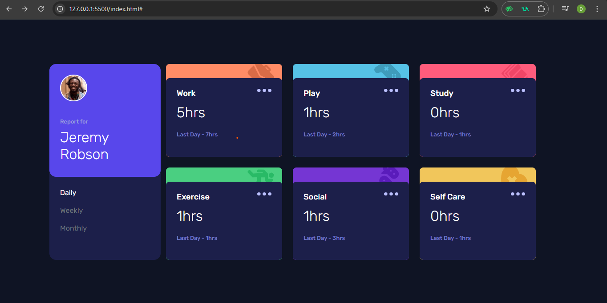

# Frontend Mentor - Time Tracking Dashboard


## 🚀 Overview

This is my solution to the [Time Tracking Dashboard challenge](https://www.frontendmentor.io/challenges/time-tracking-dashboard-UIQ7167Jw) on Frontend Mentor. The goal was to build a responsive dashboard that displays time spent on various activities, with the ability to switch between daily, weekly, and monthly views.

## 🖥️ Live Demo

- **Live Site:** https://time-tracking-dashboard-xi-rosy.vercel.app/
- **Solution:** https://github.com/dawood125/Time-tracking-dashboard

## 📸 Screenshot



## 🎯 Features

- Responsive layout for mobile and desktop
- Switch between Daily, Weekly, and Monthly stats
- Hover states for interactive elements
- Data loaded dynamically from `data.json`
- Clean, semantic HTML and modern CSS

## 🛠️ Built With

- HTML5
- CSS3 (Flexbox, Grid, Custom Properties)
- JavaScript (ES6)
- Bootstrap 5
- [Rubik](https://fonts.google.com/specimen/Rubik) font

## 📚 What I Learned

- How to structure a dashboard UI with semantic HTML and CSS Grid/Flexbox
- Dynamically updating UI based on user interaction using JavaScript
- Handling JSON data and updating DOM elements efficiently
- Responsive design techniques for different screen sizes
- Improving accessibility and user experience with focus/hover states

### Example: Dynamic UI Update

```js
// Update activity cards based on selected timeframe
function updateUI(data, filter) {
  const filterLabels = { daily: "Yesterday", weekly: "Last Week", monthly: "Last Month" };
  data.forEach((activity, index) => {
    const card = document.querySelectorAll(".activity-content")[index];
    card.querySelector(".current-hours").textContent = `${activity.timeframes[filter].current}hrs`;
    card.querySelector(".previous-hours").textContent =
      `${filterLabels[filter]} - ${activity.timeframes[filter].previous}hrs`;
  });
}
```

## 🔄 Continued Development

- Add animations for smoother transitions between timeframes
- Improve accessibility (ARIA roles, keyboard navigation)
- Refactor JavaScript for better scalability
- Add unit tests for UI logic

## 🔗 Useful Resources

- [Frontend Mentor Community](https://www.frontendmentor.io/community)
- [MDN Web Docs - Flexbox](https://developer.mozilla.org/en-US/docs/Web/CSS/CSS_Flexible_Box_Layout/Basic_Concepts_of_Flexbox)
- [MDN Web Docs - Grid](https://developer.mozilla.org/en-US/docs/Web/CSS/CSS_Grid_Layout)
- [JavaScript Fetch API](https://developer.mozilla.org/en-US/docs/Web/API/Fetch_API/Using_Fetch)

## 👤 Author

- Dawood Ahmed  
- GitHub: [@dawood125](https://github.com/dawood125)  
- Frontend Mentor: [@dawood125](https://www.frontendmentor.io/profile/dawood125)  

## 🙏 Acknowledgments

Thanks to the Frontend Mentor community for feedback and support. Special thanks to anyone whose resources or advice helped me complete this challenge!

---

**Feel free to fork, clone, and use this project for